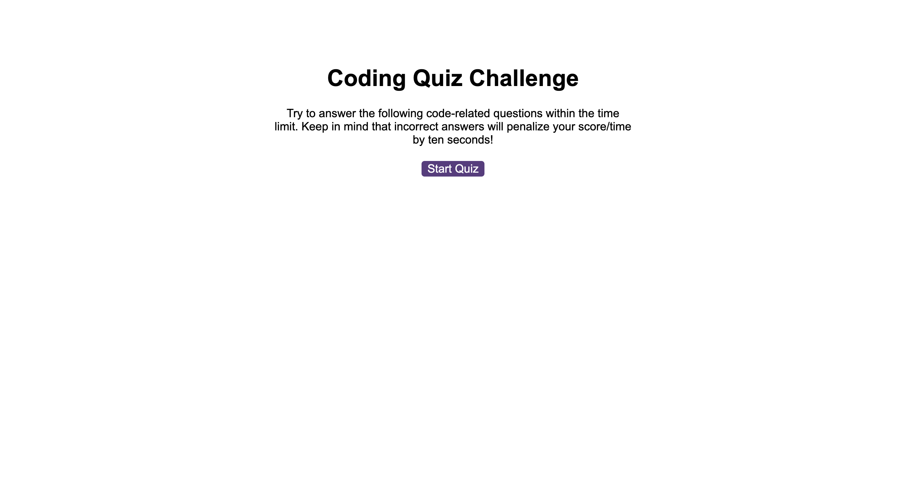

# timed-quiz

## Description

This repository was created to build a timed coding quiz with multiple-choice questions. Highscores can be saved.

## Usage

Press the button "Start Quiz" to strat. The timer will start, try to answer the qestions as quick as you can but keep in mind that if you pick the incorrect answer your time will be reduced by 10s. When you will answer all questions or timer will end up you will be able to submit your score. If you wish to check saved scores press the link "View Highscores". If you want to delete them press "Clear Highscores" else press "Go Back"

## Link

https://1eva1987.github.io/timed-quiz/

## License

MIT license
